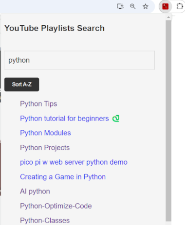
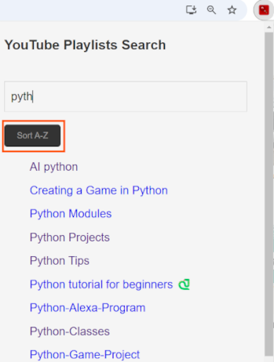
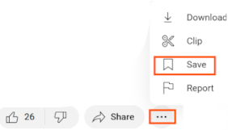
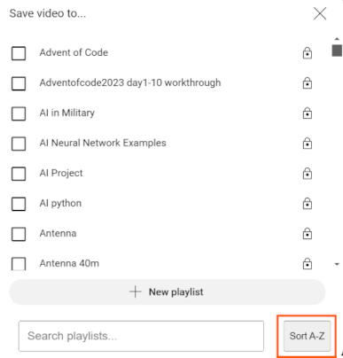

# Chrome Extension - YouTube Playlists Search+

Chrome Extension for YouTube Playlists to add Search option to view and save

## Description

Chrome Extension that will:

- List all your Playlists and allow you to search and sort.
- Adds search and sort to save video to... playlist

## Feature Overview

- List Playlists, Search, Sort.
  - After install, pin YouTube Playlists Search+ Extension (Instructions below)
  - Navigate to your YouTube Playlist page
  - Click on the YouTube Playlists Search extension Icon

# Search

# Sort

- Save YouTube Video, Search and Sort your Playlists to Save Video.

# Save

# Search

# Sort

## INSTALL

## Download YouTube Playlists Search

Options either

- Clone Repo
- Click on '<> Code' green Icon top right and Download Zip, extract
- Click on 'Releases' middle right and download Source Code, extract

## Load Chrome Extension manually

1.  Go to the Extensions page by entering chrome://extensions in a new tab. (By design chrome:// URLs are not linkable.)

Alternatively, click the Extensions menu puzzle button and select Manage Extensions at the bottom of the menu.
Or, click the Chrome menu, hover over More Tools, then select Extensions.

2.  Enable Developer Mode by clicking the toggle switch next to Developer mode.
3.  Click the Load unpacked button and select the extension directory.

Ta-da! The extension has been successfully installed. If no extension icons were included in the manifest, a generic icon will be created for the extension.

## Pin the extension

By default, when you load your extension locally, it will appear in the extensions menu ().
Pin your extension to the toolbar to quickly access your extension during development.

Click the extension's action icon (toolbar icon); you should see a popup.

## Requirements

Chrome Browser
